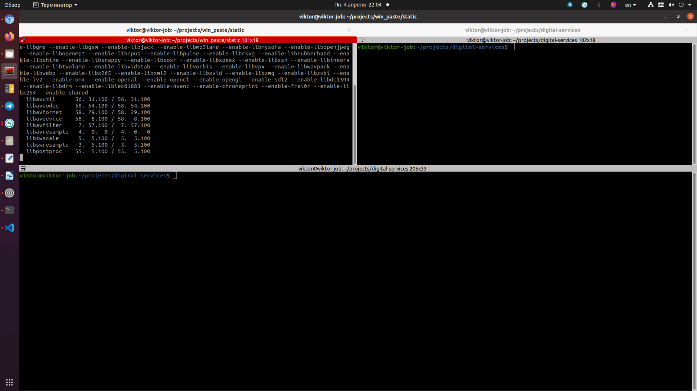

# Копипаст туда, куда нельзя вставить
Бывает такое, что необходимо вставить текст туда, где не предусмотрена возможность вставки текста.  
Не работает Ctrl+v и нет других способов это сделать.  
Например это может быть удаленный рабочий стол Windows или терминал сервера расшареный в браузере или просто вы подключились к консоли KVM.

Я попал в такую ситуацию, мне надо было ввести длинный текст в консоль KVM и я сделал себе утииту, которая позволят это сделатью 
Она позваляет вставлять любой однострочный текс в такие "неудобные места".

##### Установка:
```
cd /tmp/ 
git clone https://github.com/viktor-gorinskiy/prints.git
sudo cp /tmp/prints/main.py /usr/bin/prints
sudo chmod +x /usr/bin/prints
````
##### Установка зависимостей
```
pip install keyboard
pip install wheel
pip install pynput
pip install progress
```
##### Или так:
```
pip install -r requirements.txt
```
#### Использование:
```prints "текст который надо вставить" 10```
Где 10 это задержка в секундах, чтоб успеть установить курсор в нужное место.
#### И анимация как это работает


#### P.S.
Я не успел сделать каких-либо проверок и обработку исключений. Мне так понравилась этот инструмент, что я спешу поделиться им с Вами, позже я конечно всё сделаю как следует. 
